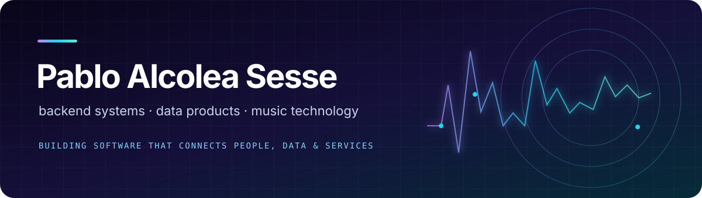

  

  I build web applications and backend services, and run a homelab to explore systems and networking. My projects connect what I study with practical problems, including equity screening and self-hosted infrastructure.

 

## ⚡ Selected projects

<table>
  <tr>
    <td>
      <h3><a href="https://github.com/PabloAlcoleaSesse/PA-26003-1">Stock Screening and Outcome Tracking ↗</a></h3>
      
Screens US equities using fundamental and technical criteria, records screening runs, and tracks subsequent outcomes against SPY.

      
<code>Python</code> &nbsp; <code>PostgreSQL</code> &nbsp; <code>pandas</code> &nbsp; <code>yfinance</code> &nbsp; <code>Docker</code>

    </td>
  </tr>
</table>

 

## ◇ Technical interests

| Area | Focus |
| :--- | :--- |
| **Web and backend development** | building interfaces, APIs, and database-backed applications. |
| **Systems and infrastructure** | experimenting with self-hosting, containers, and networking in my homelab. |
| **Computer science** | developing my foundations in algorithms, data structures, and software design through coursework and personal projects. |

 

---

<h3 align="center">Connect</h3>

  <a href="https://www.linkedin.com/in/pablo-alcolea-sess%C3%A9-a672a2338/"><strong>LinkedIn ↗</strong></a>
  &nbsp; · &nbsp;
  <a href="mailto:pabloalcolea.dev@gmail.com"><strong>Email ↗</strong></a>

